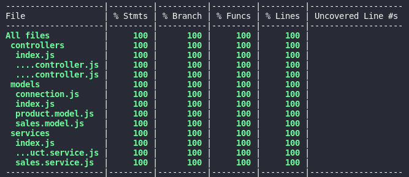

# Projeto Store Manager

Esse projeto foi realizado durante o Modulo de Back-end no Bloco 5 da formação da Trybe em setembro de 2022.

## O que foi desenvolvido

Uma API utilizando a arquitetura MSC (model-service-controller)!

A API é um sistema de gerenciamento de vendas no formato dropshipping em que é possível criar, visualizar, deletar e atualizar produtos e vendas. Foi utilizado o banco de dados MySQL para a gestão de dados.

Foram realizados testes unitarios para testar as camadas de forma isolada, de forma a otimizar a aplicação para futuras manutenções. Foi atingido 100% de cobertura de testes em todas as camadas.

## Como rodar a aplicação

Clone o repositório com o comando `git clone git@github.com:GusCabraal/project-store-manager.git`

- ### Usando o docker

Há um arquivo `docker-compose.yml` configurado na raiz do projeto com os serviços `node` e `db`, rode o comando `docker-compose up -d` para subir os containers, e dentro do container `blogs_api` instale as dependencias com `npm install`.

## Rotas da aplicação

Há uma coleção de endpoints em formato JSON para importar no Insomnia no arquivo `routes-project-store-manager.json`;

### Rotas de produtos

- GET `/products` -> Lista todos os produtos;
- GET `/products/search?q=name` -> Filtra os produtos com base no seu nome;
- GET `/products/:id` -> Busca um produto pelo seu ID;
- POST `/products` -> Cadastra um novo produto;
- DELETE `/products/:id` -> Deleta um produto com base no seu ID;
- PUT `/products/:id` -> Atualiza um produto com base no seu ID;

### Rotas de vendas

- GET `/sales` -> Lista todos as vendas;
- GET `/sales/:id` -> Busca uma venda pelo seu ID;
- POST `/sales` -> Cadastra uma nova venda com base nos produtos vendidos e suas respectivas quantidades;
- DELETE `/sales/:id` -> Deleta uma venda com base no seu ID;
- PUT `/sales/:id` -> Atualiza uma venda com base no seu ID;
